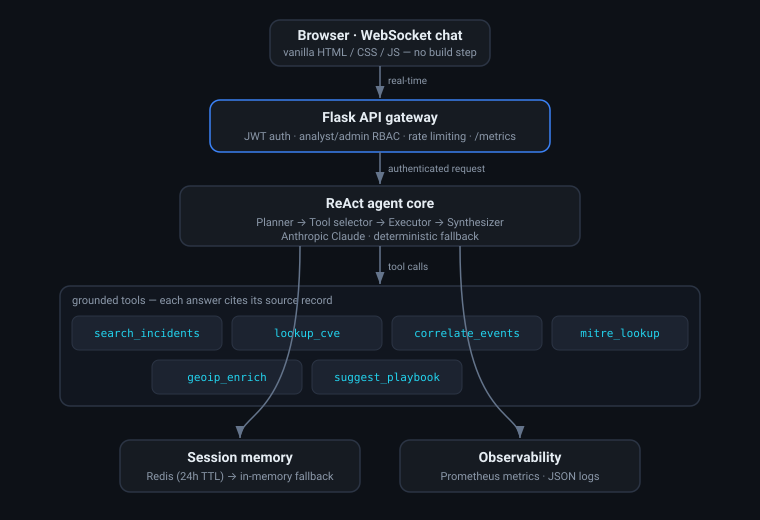

# SOC Copilot

**A ReAct security-operations agent that supports L1 SOC triage** — context
enrichment, event correlation, MITRE ATT&CK mapping, and remediation playbooks — through a
real-time chat interface with transparent, cited reasoning.

<p align="center">
  
</p>

[](https://github.com/Vincent-P-essy/soc-copilot/actions/workflows/ci.yml)


---

## Why this exists

An L1 analyst who receives *"brute-force alert on `185.220.101.44`, 47 attempts in 3 minutes,
user `admin`"* spends the next ten minutes pivoting between six tools: geo-IP lookup, the
incident tracker, a CVE database, the MITRE matrix, and a playbook wiki. SOC Copilot does that
pivoting in one turn and hands back a cited synthesis:

```
Analyst> brute force on 185.220.101.44, 47 attempts in 3 min, user admin

[thought]  Suspicious IP + auth pattern. I need geo context, related incidents,
           the ATT&CK technique and any exploitable SSH CVEs.
[action]   geoip_enrich(ip="185.220.101.44")        -> Tor exit node (DE)
[action]   search_incidents(ip="185.220.101.44")    -> 2 similar incidents / 30d
[action]   mitre_lookup(query="brute force")         -> T1110.001 Password Guessing
[action]   lookup_cve(service="ssh")                 -> CVE-2024-6387 (regreSSHion)

Synthesis
  Known Tor exit node with prior activity against this estate. Pattern maps to
  T1110.001 (Password Guessing). An unpatched OpenSSH would expose CVE-2024-6387.

Recommendation
  1. Block 185.220.101.44 at the edge (Tor exit, no business need).
  2. Rotate the `admin` credential and enforce MFA.
  3. Review sshd auth logs for the last 72h; confirm OpenSSH >= 9.8p1.

Playbook: IR-002 — Credential Attack Response
Sources: geoip_enrich, search_incidents, mitre_lookup, lookup_cve
```

Every recommendation is traceable to the tool call and record that produced it.

---

## Highlights

| Capability | Detail |
|---|---|
| **ReAct agent core** | Explicit `Thought → Action → Observation` loop; each step is streamed to the UI |
| **6 grounded tools** | `search_incidents`, `lookup_cve`, `correlate_events`, `mitre_lookup`, `geoip_enrich`, `suggest_playbook` |
| **Runs with *or* without an LLM** | Anthropic Claude when `ANTHROPIC_API_KEY` is set; a deterministic planner otherwise — so tests and demos need zero secrets |
| **Session memory** | Redis-backed conversation history with 24h TTL, in-memory fallback for local dev |
| **Multi-user + RBAC** | JWT auth, `analyst` / `admin` roles, per-user rate limiting |
| **Cited answers** | Responses carry a `sources` list mapping each claim to its tool + record |
| **Observability** | Prometheus metrics (`/metrics`), structured JSON logs, p50/p95 latency, per-tool usage |
| **Real-time UI** | Vanilla HTML/CSS/JS chat over WebSocket, no build step |

---

## Quick start

```bash
git clone https://github.com/Vincent-P-essy/soc-copilot
cd soc-copilot
python -m venv .venv && source .venv/bin/activate
pip install -r requirements.txt

cp .env.example .env          # edit SECRET_KEY (and ANTHROPIC_API_KEY if you have one)
python -m backend.app         # http://localhost:8000
```

Open <http://localhost:8000>, log in with the seeded `analyst` / `analyst` account, and try:

> *"I see repeated 401s from 45.155.205.0/24 against the VPN, then a successful login. What is this?"*

No Redis? No LLM key? It still works — memory falls back to in-process storage and the agent
uses the deterministic planner.

### Docker

```bash
docker compose up --build      # app + redis + prometheus
```

- App: <http://localhost:8000>
- Metrics: <http://localhost:8000/metrics>
- Prometheus: <http://localhost:9090>

---

## Architecture

```
Browser (WebSocket chat)
        │
        ▼
Flask API gateway ── JWT auth ── rate limiting ── Prometheus metrics
        │
        ▼
ReAct agent core ── Planner → Tool selector → Executor → Synthesizer
        │                                   │
        │                                   ├── search_incidents   (incident store)
        │                                   ├── lookup_cve          (NVD-shaped cache)
        │                                   ├── correlate_events    (correlation engine)
        │                                   ├── mitre_lookup        (ATT&CK dataset)
        │                                   ├── geoip_enrich        (geo/Tor dataset)
        │                                   └── suggest_playbook    (IR knowledge base)
        ▼
Session memory (Redis, 24h TTL → in-memory fallback)
```

See [`docs/ARCHITECTURE.md`](docs/ARCHITECTURE.md) for the design rationale — why ReAct over a
fixed pipeline, how tool grounding prevents hallucinated IOCs, and the LLM-abstraction contract.

---

## Configuration

All configuration is environment-driven (see [`.env.example`](.env.example)).

| Variable | Default | Purpose |
|---|---|---|
| `SECRET_KEY` | `dev-insecure-change-me` | JWT signing key — **must** be changed in production |
| `ANTHROPIC_API_KEY` | *(unset)* | Enables the Claude-backed planner; falls back to the deterministic planner when unset |
| `SOC_COPILOT_MODEL` | `claude-opus-4-8` | Model id for the LLM planner |
| `REDIS_URL` | *(unset)* | Redis connection string; in-memory store used when unset |
| `SESSION_TTL_SECONDS` | `86400` | Conversation memory lifetime |
| `RATE_LIMIT_PER_MINUTE` | `30` | Per-user request budget |
| `PORT` | `8000` | HTTP listen port |

---

## Testing

```bash
pytest                     # unit + integration
pytest --cov=backend       # with coverage
ruff check backend tests   # lint
```

The suite covers each tool in isolation, the agent loop with a mocked LLM, auth/RBAC, and three
end-to-end triage scenarios (brute force, malware hash, phishing domain).

---

## Project layout

```
backend/
  app.py              # Flask app factory + WebSocket handler
  config.py           # env-driven settings
  auth.py             # JWT issuance/verification, RBAC
  rate_limit.py       # token-bucket limiter
  sessions.py         # Redis / in-memory conversation memory
  metrics.py          # Prometheus collectors
  agent/
    core.py           # ReAct loop
    llm.py            # LLM provider abstraction (Anthropic + deterministic)
    prompts.py        # system prompt + tool schema rendering
    tools/            # the six grounded tools
  data/               # incident, CVE, ATT&CK, playbook, geo datasets
frontend/             # vanilla WebSocket chat UI
tests/                # unit, integration, e2e
docs/                 # architecture notes + diagram
```

---

## Roadmap

- [ ] Streaming token-level responses in the UI
- [ ] Pluggable real backends (Elastic, TheHive, OpenCTI) behind the tool interface
- [ ] Feedback capture (thumbs up/down) to build an evaluation set
- [ ] SSO (OIDC) alongside local accounts

---

## License

MIT © Vincent Plessy — see [`LICENSE`](LICENSE).
